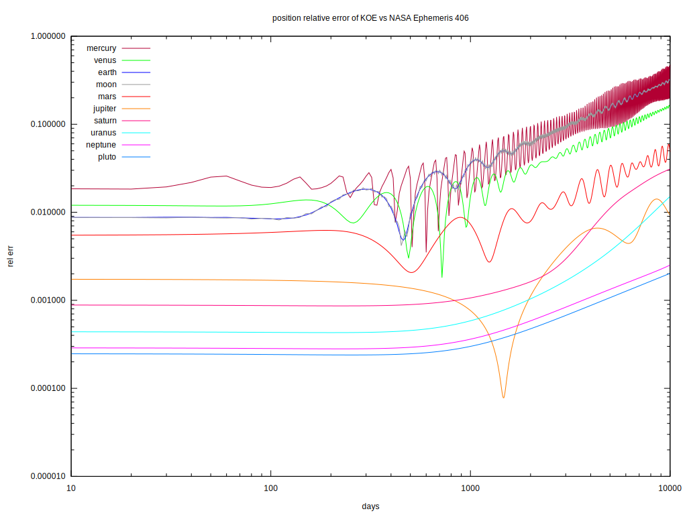
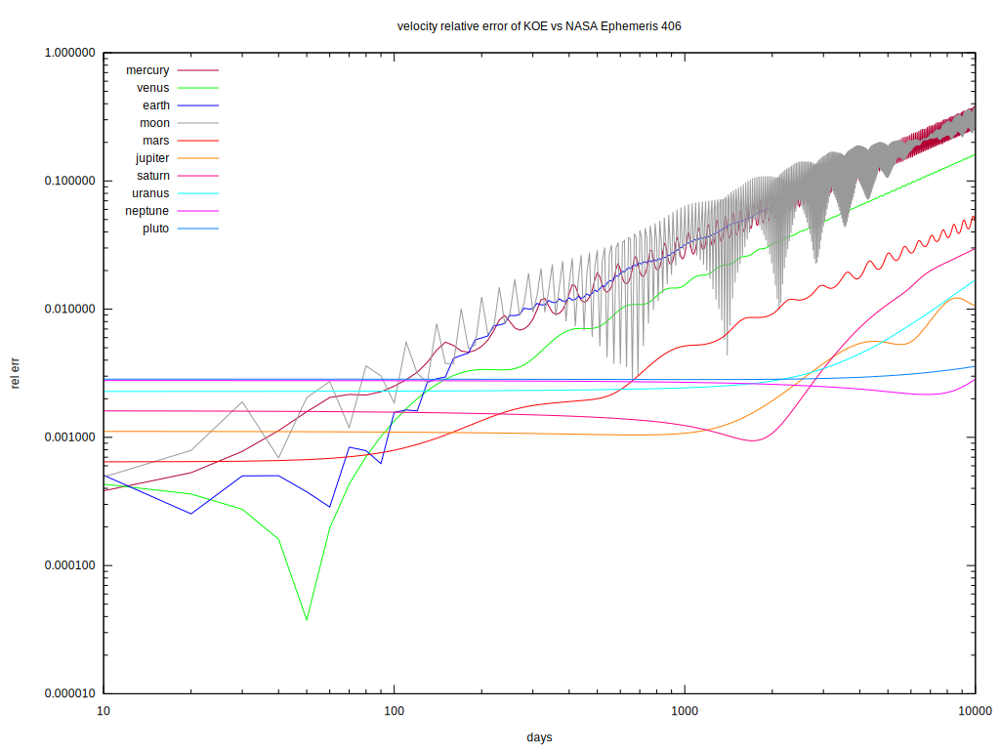

 

The standalone version of my solarsystem project: https://github.com/thenumbernine/solarsystem
This operates on Ephemeris 406

To get the Ephemeris 406 data:
1) download all the files at ftp://ssd.jpl.nasa.gov/pub/eph/planets/ascii/de406/ into eph/406
1b) optionally use the download.lua script, which requires wget
2) run the asc2fits.lua script to compress the files

- run solarsystem.lua to see the solar system simulation
- run graph.lua to see the conjugations and distances between planets

- visualize-smallbodies.lua 
	This uses the smallbodies.raw, which is produced in my webgl solarsystem project, inside jpl-ssd-smallbody/output-points.template.lua 

depends on
- my lua-ext library
- my imguiapp library
- my plot2d for graph.lua

